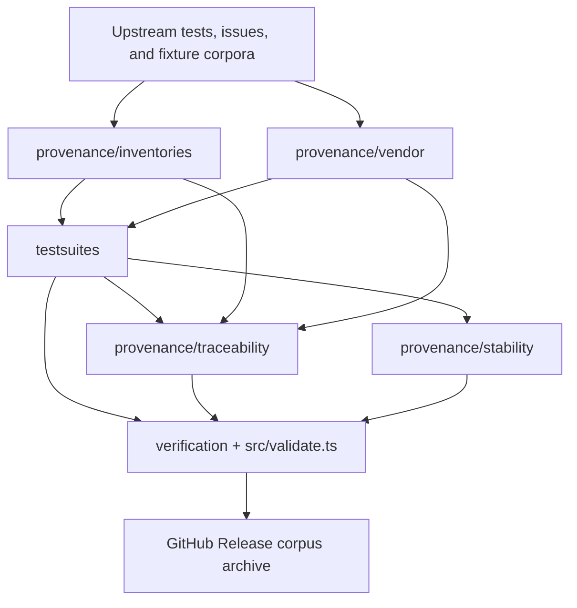

# Repository Architecture

This repository has two surfaces:

- the release corpus, which downstream implementations can vendor directly
- the repository machinery, which maintains, validates, and publishes that corpus

The most important rule is: `testsuites/` is the conformance corpus; `verification/` is how this repository checks itself.

## Directory Map

### Release Corpus

These paths are part of the canonical GitHub Release corpus archive.

| Path              | Role                                                                                                                  |
| ----------------- | --------------------------------------------------------------------------------------------------------------------- |
| `README.md`       | Project entrypoint and distribution instructions.                                                                     |
| `ARCHITECTURE.md` | Directory map and maintenance model.                                                                                  |
| `spec/`           | Human-readable Vue language specification chapters.                                                                   |
| `testsuites/`     | Machine-readable conformance artifacts for parser, syntax, compiler, type evaluation, runtime, and benchmark targets. |
| `schemas/`        | Pkl schemas that define the allowed shape of machine-readable suites and manifests.                                   |
| `runtime/`        | JavaScript harness code used by the TypeScript runtime conformance suites.                                            |
| `provenance/`     | Local evidence, generated inventories, traceability manifests, stability manifests, and release metadata.             |
| `fixtures/`       | Reusable benchmark and corpus input files.                                                                            |

### Repository Machinery

These paths are for maintaining the corpus. They are not the conformance corpus itself.

| Path            | Role                                                                                                                   |
| --------------- | ---------------------------------------------------------------------------------------------------------------------- |
| `src/`          | Local JavaScript API, CLI, validators, catalog builders, release-manifest builders, and report generation.             |
| `scripts/`      | Maintenance scripts for vendoring, generating imported suites, refreshing traceability, and building release archives. |
| `verification/` | Vitest checks that validate the repository and execute reference/runtime smoke tests.                                  |
| `.github/`      | GitHub Actions workflows for publishing release corpus archives.                                                       |
| `dist/`         | Generated local build/release output. It is ignored by git.                                                            |
| `node_modules/` | Installed dependencies. It is ignored by git.                                                                          |

## Mental Model

Read the repository in this order:

1. `spec/` says what behavior matters.
2. `testsuites/` turns that behavior into executable artifacts.
3. `schemas/` defines what those artifacts are allowed to look like.
4. `runtime/` supports only the JavaScript runtime suites under `testsuites/runtime/`.
5. `provenance/` explains where cases came from and how much upstream evidence is covered.
6. `src/`, `scripts/`, and `verification/` keep all of the above generated, checked, and releasable.

## Important Distinctions

### `testsuites/` vs `verification/`

`testsuites/` contains artifacts downstream implementations should consume.

`verification/` contains tests for this repository. Those files check schema validity, manifest freshness, upstream references, runtime behavior, and release invariants. They are not themselves the shared conformance corpus.

### `testsuites/runtime/` vs `runtime/`

`testsuites/runtime/` contains runtime conformance cases.

`runtime/` contains helper code used to execute those cases in a JavaScript reference environment.

### `provenance/` vs `testsuites/`

`provenance/` stores evidence and traceability.

`testsuites/` stores the normalized local conformance artifacts that implementations can run or translate.

## Common Entry Points

| Task                                  | Start Here                                                                                                              |
| ------------------------------------- | ----------------------------------------------------------------------------------------------------------------------- |
| Implement a template parser           | `spec/02-sfc-syntax.md`, then `testsuites/parser/template/`.                                                            |
| Implement SFC syntax support          | `spec/02-sfc-syntax.md`, then `testsuites/syntax/sfc/`.                                                                 |
| Implement compiler behavior           | `spec/03-template-and-compiler.md`, then `testsuites/compiler/`.                                                        |
| Implement macro/type evaluation       | `spec/04-type-evaluation.md`, then `testsuites/type-evaluation/`.                                                       |
| Check DOM-observable runtime behavior | `spec/05-runtime-conformance.md`, then `testsuites/runtime/` and `runtime/`.                                            |
| Compare benchmark workloads           | `spec/06-benchmark-methodology.md`, then `testsuites/benchmark/` and `fixtures/benchmarks/`.                            |
| Audit evidence and coverage           | `spec/07-upstream-provenance.md`, then `provenance/inventories/`, `provenance/vendor/`, and `provenance/traceability/`. |

## Generation Flow

## Placement Rules

- Put normative prose in `spec/`.
- Put shared conformance artifacts in `testsuites/`.
- Put artifact schemas in `schemas/`.
- Put copied upstream evidence, generated inventories, and coverage mapping in `provenance/`.
- Put reusable input data in `fixtures/`.
- Put executable repository maintenance code in `src/` or `scripts/`.
- Put repository self-checks in `verification/`.
- Do not place repository-only Vitest checks in `testsuites/`.
- Do not place raw upstream source directly in `testsuites/`; normalize it into local suites and keep the source under `provenance/vendor/`.
